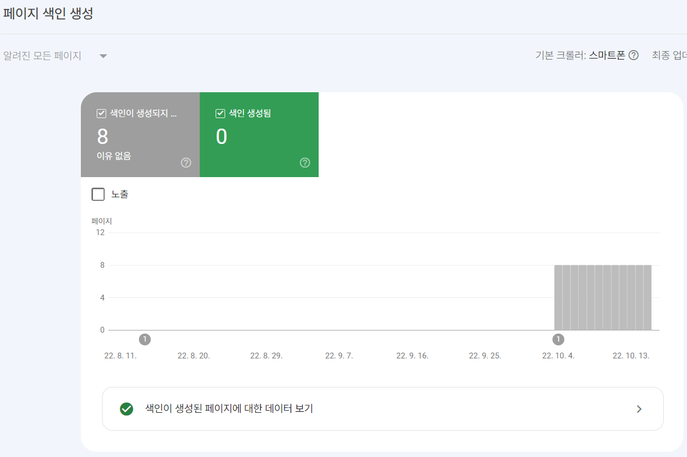

  
이게 좋은건지 안좋은건지 색인 생성이 하나도 안되고 있다. 아마 포스트를 몇개 더 적어봐야 알 것 같기도 하지만 현재로서 방법을 찾지는 못했다. 어차피 개인 저장용으로 쓰는 블로그도 아닌데 수익성이라도 띄면 얼마나 좋을까 하는 생각이 드는 건 아니고, 유용한 글을 올릴 때도 몇 번 있어서 차라리 검색이 가능해지면 다른 사람들한테도 괜찮은 정보가 보여지니 좋은 거 아닌가? 하는 생각 때문이다.  
너무 발목잡혀있어서 더 이상 안되면 과감히 그만 둘 생각이다.
