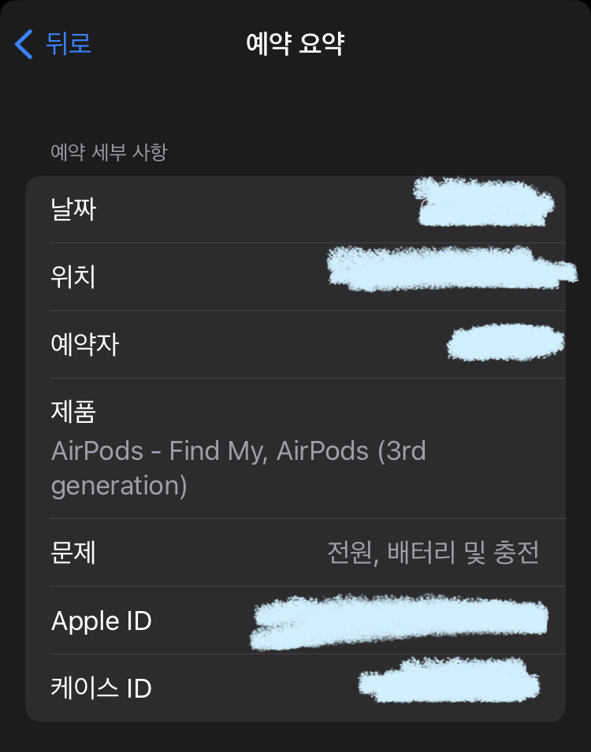

## 에어팟 3이 갑자기 죽었다

이게 뭔 상황인가 싶은데 어느날 갑자기 왼쪽 유닛이 작동하지 않았다. 이 글을 올리기 일 주 전엔 충전하면 됐는데 이젠 그냥 **죽었다.** 어림도 없지. 바로 서비스센터.

## '지원' 앱을 쓰면 모든 과정이 쉽다

  

아이폰 '지원'앱으로 들어간 다음, 상담사한테 전화를 거는 부분이 있어 일단 먼저 걸어보고(지역 A/S 센터 엔지니어 아님), 무상 교체가 되는지(이게 제일 중요!!)부터 물어봤다. 점검 받아봐야 알 것 같다고 그러던데, A/S 센터마다 기준이 달라서 그런지 잘 모르겠고 와하하~  

주말에 개천절까지 끼어있어서 화요일에 바로 달려갔다. 이 동네 위니아에이드는 전에 쓰던 아이폰 배터리 교체하러 한 번 와본 것이 전부인데 변한 게 하나도 없었다. 일단 입구 주변에 있는 아이패드에 **예약**탭을 누르고, '지원' 앱에서 예약하며 입력한 내 정보를 입력해주면 끝난다. 이번엔 아이폰 DP는 안되어있었다... 그래서 못 보고오긴 했는데 사실상 보고 올 시간도 없이 엔지니어분이 불러서 갔다. 그 때는 아이폰 XS Max가 있었던 것 같기도 하고? 꽤 예전이라 잘 모른다.

"이래이래 해서 왼쪽이 연결이 안되고 충전이 안되는 것 같다."라고 했더니 엔지니어분이 15분에서 20분 가량 테스트 몇 번 하고 오셔서 "교체를 위해서 애플 사측으로 보내야 한다."라고 말씀을 해주셨고, 꽤 바로 끝나버렸다.  

## 보증 기간은 어디에 어떻게 적용되는걸까...?

그리고 MagSafe Charging Case **Set**이라고 쓰여있는 문구를 보고 케이스만 교체되나 싶었는데, 좌, 우측 유닛과 케이스까지 한꺼번에 교체가 된다고 하신다. 보증 기간이 남아있어서 그런건지, 아니면 에어팟이 알아서 불량이 생긴건지는 나는 잘 모르고 딱히 번거롭지도 않았다. 점검 비용 표에 2만 원의 '미분해 점검'비용이 발생하던데, **일단 나는 안냈다.** 엔지니어분이 말씀하신 것도 없고 한데 보증 기간이 남아있으면 안내도 되는 것 같더라?! 돈 한 푼 안쓰는거 개꿀 ㅎ;; 사실 불량 생기면 치명적이지 않은 문제들은 A/S 안받고 쓰는게 대부분이라 하하 난몰라~  
교환이 확정되면 인수증을 들고 오신다. 받고, 서명하고, 인사드리고 나오면 된다.  

## 수령 (북쪽 그 사람 아님)

.jpg)
다 구겨졌다... 잘 보관하려 했는데... 인수증을 가지고 3-4일 이후에 교환된 기기를 찾으러 가야한다. 이거 없으면 당연히 못받을 것 같은데 괜히 준 거 아니니까 가져가길 바란다.  

가서 어슬렁거리다 물건 찾으러 왔다고 말 한 번 해주면 마참내 내 에어팟을 가지고 갈 수 있다. 받고 나서 보니 다른 부품에 문제는 없다며 왼쪽 유닛만 교체를 받았다.  

에어팟 교체받으시는 분들께 좋은 후기가 될 수 있길 바라며!
